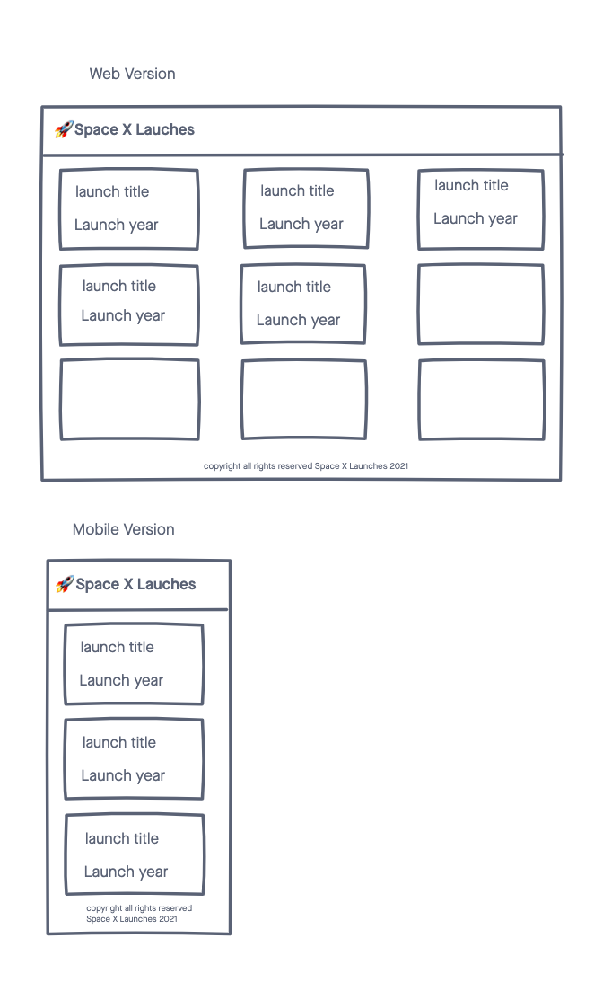

# 🚀 Space X Launches

A simple web app for visualizing Space X launches

## Technologies
- HTML5
- CSS3
- JavaScript/jQuery
- [Space X API](https://api.spacexdata.com/v3/launches)

## Screenshots

### Wireframe

### Images of Working APP

## Geting Started

[Click Here](#) to see working app

## Future Enhancements
- Show the launch patch for every lauch
- Show launch details in a popup model
- allow a user to save their favorite launches